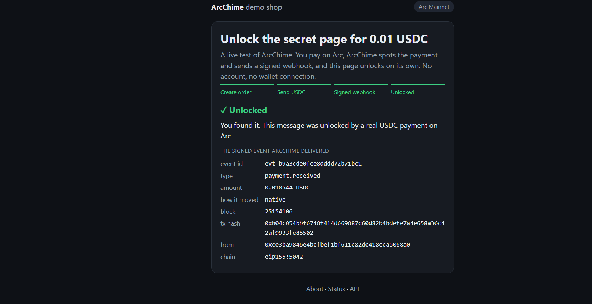
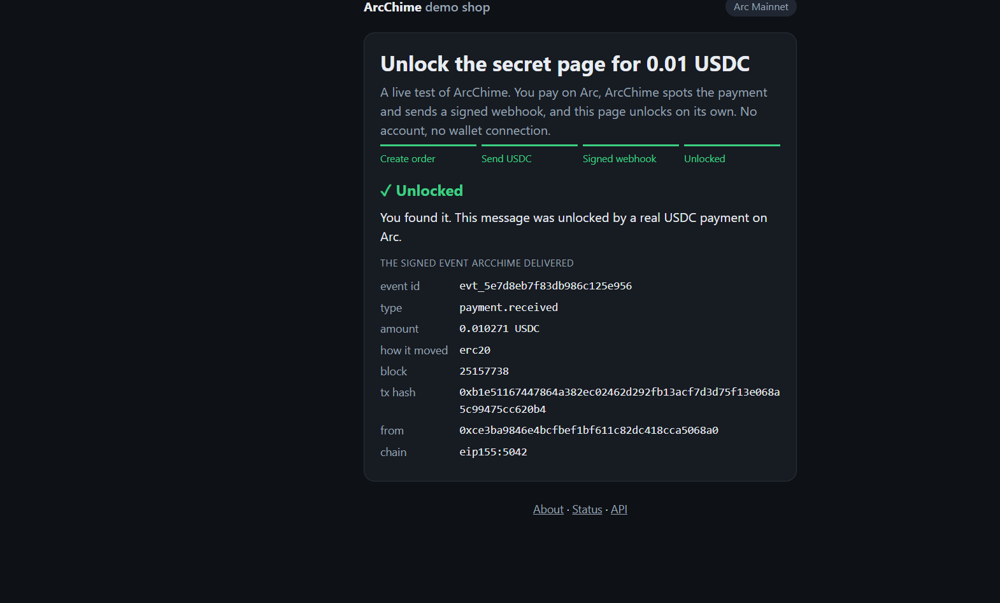

# ArcChime

**Signed webhooks for USDC payments on Arc.** Register an address and a URL. ArcChime watches Arc for USDC arriving at that address and sends your server a signed, normalized `payment.received` event, with retries, replay, and a block-hash check.

**Live on Arc mainnet:** https://chime.cookie2001.me (landing page shows the live chain ID and block height) · **Demo shop:** https://chime.cookie2001.me/shop · **Demo video:** _add link_

> Status: small, unaudited proof of concept, running against Arc mainnet. See [Limitations](#limitations).

## What it does

A blockchain does not tell your app that you got paid. A customer sends USDC, the money lands in your wallet, and nothing else happens: your site, database, and email system never find out. ArcChime is that missing notification.

```
payer ──USDC──▶ Arc ──▶ ArcChime ──signed webhook──▶ your server ──▶ unlock page / mark invoice paid / release download
```

## Why this exists (and why not just use a hosted webhook provider?)

Hosted providers such as QuickNode already offer address webhooks for Arc, and they are a fine choice if you want a managed service. ArcChime is for when you want something you can **self-host with no account or API key**, that speaks in **payments rather than raw logs**:

- **One event per payment, in plain USDC.** Arc moves USDC two ways and logs them differently (below). Handling that by hand is an easy way to double-count a payment or mis-scale it by 10^12.
- **Small and readable.** About 900 lines of Python, SQLite, no web3 dependency, 26 automated tests.
- **Delivery semantics you can reason about:** at-least-once, stable event ids, timestamped HMAC signatures, retries with backoff, manual replay, and a block-hash check before the first delivery.

## Mainnet evidence (Arc Mainnet, chain ID 5042)

Both payment paths, detected and delivered through the live demo shop:

| Path | Transaction | Shop reported |
|---|---|---|
| Native USDC send | [0xb04c…5502](https://explorer.arc.io/tx/0xb04c054bbf6748f414d669887c60d82b4bdefe7a4e658a36c42af9933fe85502) | `how it moved: native` |
| ERC-20 `transfer()` on the USDC contract | [0xb1e5…20b4](https://explorer.arc.io/tx/0xb1e51167447864a382ec02462d292fb13acf7d3d75f13e068a5c99475cc620b4) | `how it moved: erc20` |




## What we learned about Arc

USDC is Arc's gas token, so the same balance is reachable through two interfaces, and they emit different logs. Observed on Arc:

| How USDC moved | Logs emitted | Raw decimals |
|---|---|---|
| Native send (value transfer) | one `Transfer` from `0xFFFF…FFFE` | 18 |
| ERC-20 `transfer()` on `0x3600…0000` | **two** `Transfer` logs: `0xFFFF…FFFE` (18 dec) **and** `0x3600…0000` (6 dec) | 18 and 6 |

A listener that watches only the token contract misses every native payment; one that watches both double-counts every ERC-20 payment. ArcChime watches both, merges the pair into a single event, and reports `amount` in plain USDC (`amount_raw` and `raw_decimals` are included for auditing).

Arc's own docs describe the system-address event (EIP-7708) as the way to capture every native USDC movement in one stream, and also describe an earlier event behavior from before a network upgrade. Watching both addresses and merging stays correct either way. (The earlier behavior is not tested here.)

Earlier testnet evidence (chain 5042002): native send [`0xdaab…1fb7`](https://testnet.arcscan.app/tx/0xdaabd41bb44312dcbc7f46c1ad91f1d17a91bce64b65deebd6171f3142451fb7) emitted one system-address log; ERC-20 transfer [`0x02ab…6e32`](https://testnet.arcscan.app/tx/0x02ab357b81aeacd6f73343155ec8d16ef452508fd70a0bf5f9a274ce10dd6e32) emitted two.

## Quick start

```bash
pip install -r requirements.txt
# Windows cmd: use `set NAME=value` instead of `export`
export ARC_RPC=https://rpc.testnet.arc.network   # mainnet: https://rpc.mainnet.arc.io
export CHAIN_ID=5042002                          # mainnet: 5042
export ADMIN_TOKEN=some-long-random-string
uvicorn arcchime.main:app --port 8000
```

Interactive API docs are at `http://localhost:8000/docs`. Or with curl:

```bash
# 1. register (the signing secret is shown ONCE)
curl -X POST localhost:8000/v1/endpoints \
  -H "Authorization: Bearer $ADMIN_TOKEN" -H "Content-Type: application/json" \
  -d '{"address":"0xYourArcAddress","url":"https://your-server.example/webhook"}'

# 2. check your receiver with a signed test event
curl -X POST localhost:8000/v1/endpoints/ep_xxx/test -H "Authorization: Bearer $ADMIN_TOKEN"

# 3. send USDC to that address on Arc; the webhook arrives a few seconds later
```

Run the example receiver with `ARCCHIME_SECRET=whsec_... python examples/receiver.py`. Docker: `docker build -t arcchime . && docker run -p 8000:8000 -v arcchime-data:/data --env-file .env arcchime`.

## Event payload

```json
{
  "id": "evt_9cef72913ea57a86fae41958",
  "type": "payment.received",
  "chain": "eip155:5042",
  "token": "USDC",
  "source": "native",
  "from": "0xce3b…", "to": "0x8e2d…",
  "amount": "0.010883",
  "amount_raw": "10883000000000000", "raw_decimals": 18,
  "tx_hash": "0x…", "block_number": 25007819, "block_hash": "0x…", "log_index": 0
}
```

Zero-value transfers are ignored. Addresses are lowercase. For an ERC-20 transfer, `source` is `erc20`, `amount_raw` is in 6-decimal units, and `raw_decimals` is `6`.

## Verifying signatures

Every request carries `X-ArcChime-Signature: t=<unix>,v1=<hex>`, where `v1 = HMAC-SHA256(secret, "<t>." + rawBody)`. Verify against the **raw bytes**, reject timestamps older than 5 minutes, and dedupe on `id`. Working examples: `examples/receiver.py` (Python, standard library only) and `examples/verify.js` (Node).

## API

| Method | Path | Purpose |
|---|---|---|
| POST | `/v1/endpoints` | register `{address, url}`; returns the signing secret once |
| GET / DELETE | `/v1/endpoints[/{id}]` | list / remove |
| POST | `/v1/endpoints/{id}/test` | queue a signed `endpoint.test` event |
| GET | `/v1/events?address=` · `/v1/events/{id}` | events, deliveries, and every attempt |
| POST | `/v1/events/{id}/replay` | re-deliver (same id and payload) |
| GET | `/health` | scan cursor, lag, last error (no auth) |

All `/v1` routes require `Authorization: Bearer <ADMIN_TOKEN>` when that variable is set.

## Demo shop (try the whole loop)

`/shop` uses ArcChime itself: create an order, send the exact amount shown (for example `0.010347` USDC) to the shop address on Arc, and the page unlocks within seconds, then shows the actual signed event it received. Under the hood: payment on Arc → ArcChime event → signed webhook to `/shop/webhook` → order marked paid.

Orders are matched by a **unique amount** (0.010001 to 0.010999 USDC), so one address serves many visitors at once; an order expires after 30 minutes, and open orders are capped at 500. A wrong amount does not unlock anything and is not refunded.

Enable it with `DEMO_ADDRESS` (a mainnet address you control, which receives the payments), `DEMO_SECRET`, and `DEMO_URL` (this server's own `/shop/webhook`). Locally:

```bash
export ARC_RPC=https://rpc.mainnet.arc.io CHAIN_ID=5042
export DEMO_ADDRESS=0xYourReceivingAddress DEMO_SECRET=some-long-random-string
export DEMO_URL=http://localhost:8000/shop/webhook
export ALLOW_PRIVATE_URLS=1 ALLOW_HTTP_URLS=1      # local testing only
uvicorn arcchime.main:app --port 8000               # then open http://localhost:8000/shop
```

On a server, set `DEMO_URL` to the server's own loopback address (for example `http://127.0.0.1:8810/shop/webhook`) and leave the two `ALLOW_*` flags unset. `DEMO_URL` is set by the operator, so it is trusted; webhook URLs registered through the API stay guarded against internal addresses.

## Deploying

ArcChime is one process (API, scanner, and delivery worker) with a SQLite file.

- **VPS (recommended; this is how the live instance runs):** a systemd unit behind nginx or Caddy with HTTPS. Follow `deploy/INSTALL.md`; templates are in `deploy/`. It needs a persistent disk and runs fine next to other services on a free local port.
- **Free tiers:** possible but weaker. A sleeping service does not scan, and a wiped disk loses event history. `BACKFILL_BLOCKS` (scan that many recent blocks on a fresh start; about 2.2 blocks/s, so `20000` is roughly 2.5 hours) and the seeded `DEMO_*` endpoint soften this. A `render.yaml` is included as a starting point.

| Variable | Purpose |
|---|---|
| `ARC_RPC`, `CHAIN_ID` | which network to scan |
| `CONFIRMATIONS` | blocks to wait before reporting (default 2) |
| `ADMIN_TOKEN` | **set this on any public deployment** |
| `DB_PATH` | SQLite file location |
| `BACKFILL_BLOCKS` | recent blocks to scan on a fresh start |
| `DEMO_ADDRESS`, `DEMO_URL`, `DEMO_SECRET` | enable the demo shop and re-register its endpoint at every startup |
| `ARCCHIME_PORT` | local port (used by the systemd unit) |

Never commit secrets. Keep `ADMIN_TOKEN` and `DEMO_SECRET` in the host's environment, not in the repository.

## Delivery semantics

- **At-least-once.** Your receiver must dedupe on `id`.
- Success is any `2xx`. Otherwise it retries after 10 s, 30 s, 2 min, 10 min, 1 h, then marks the delivery `failed`. Replay resets it.
- Redirects are not followed.
- **Block-hash check:** before the first attempt, ArcChime confirms the event's block hash is still the canonical one; if not, the delivery is marked `reorged` and never sent. If the RPC is unreachable it waits instead of guessing. Since Arc's docs say reorgs cannot occur, this check is defensive.
- Scanner errors back off exponentially (1 s doubling to a 30 s cap) and reset on success. A slow receiver cannot block scanning, because delivery runs on separate threads.
- Ordering across events is not guaranteed.
- On first start the scanner begins at the chain tip; after that the cursor is persisted, so a restart resumes where it stopped.
- Typical latency is a few seconds (the confirmation wait, plus up to about a second each of polling and delivery). It has not been benchmarked.

## Security notes

- **SSRF guard:** webhook URLs must be `https` and resolve to public IPs; loopback, private, link-local, and cloud-metadata ranges are rejected at registration and again before every delivery. Remaining gap: DNS is resolved once by the guard and once by the HTTP client, so DNS rebinding is not fully closed.
- With `ADMIN_TOKEN` set, every `/v1` call without a valid token returns 401 (checked against the live deployment). `/`, `/health`, `/docs`, and `/shop` are public by design; `/shop/webhook` accepts only validly signed requests.
- The reverse proxy rate-limits order creation (`deploy/nginx.conf.example`, about 10 per minute per IP); the app itself only caps open orders.
- Signing secrets are stored in plaintext in SQLite (they are needed to sign). Protect the database file.
- `ALLOW_PRIVATE_URLS` / `ALLOW_HTTP_URLS` exist for local testing only.

## Limitations

- **Finality.** Arc's documentation states that blocks are final once committed (BFT consensus, no reorganizations), so a single block is enough. ArcChime still waits `CONFIRMATIONS` blocks (default 2), but for a different reason: public RPC endpoints are often load-balanced across nodes at slightly different heights, and scanning a block one node has not yet indexed could silently skip its logs. The guarantee rests on Arc's permissioned validator set (more than two thirds must be honest); ArcChime adds nothing to it and does not independently verify it.
- **Tested on mainnet:** native sends and ERC-20 `transfer()`. **Untested:** `transferFrom`, EIP-3009 signed transfers, payments made from smart contracts (internal native transfers), mint/burn. These may or may not emit the logs ArcChime watches.
- Single process, SQLite. Not built for high availability or very large numbers of watched addresses (the address list is sent to the RPC as a log filter, and providers may cap it).
- **Memos are not extracted yet.** Arc has a Memo contract that wraps a transfer to attach an order or invoice reference, but it must be called from an externally owned account (not a smart-contract wallet), the docs list different contract addresses and event shapes on different pages, and its mainnet availability has not been verified here. The demo shop matches orders by unique amount instead.
- The shop's orders live only in the database, and a payment made after its order expired is not matched.
- Unaudited.

## Tests

```bash
python -m unittest discover -s tests -v
```
26 tests cover decimals handling, merging of the two-log case, signatures, the SSRF guard (including the operator-trusted `DEMO_URL` exception), retry and replay, the block-hash check, scanner backoff, the shop's order matching, and full runs from a fake RPC through scan and delivery to an unlocked order. The HTTP layer is a thin wrapper over those functions and has been exercised on the live deployment.

## License

MIT, see `LICENSE`.
